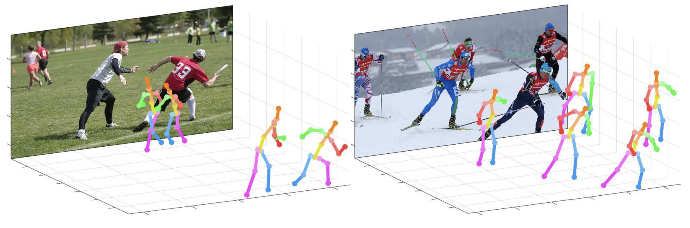
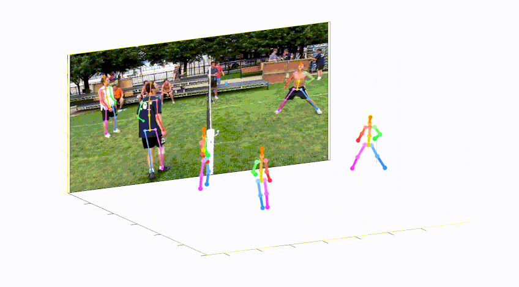
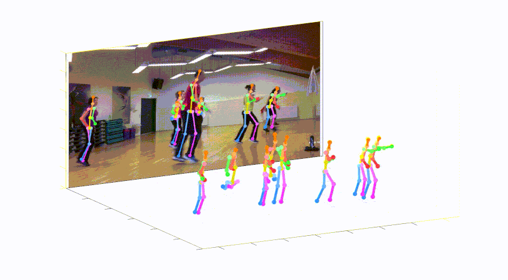
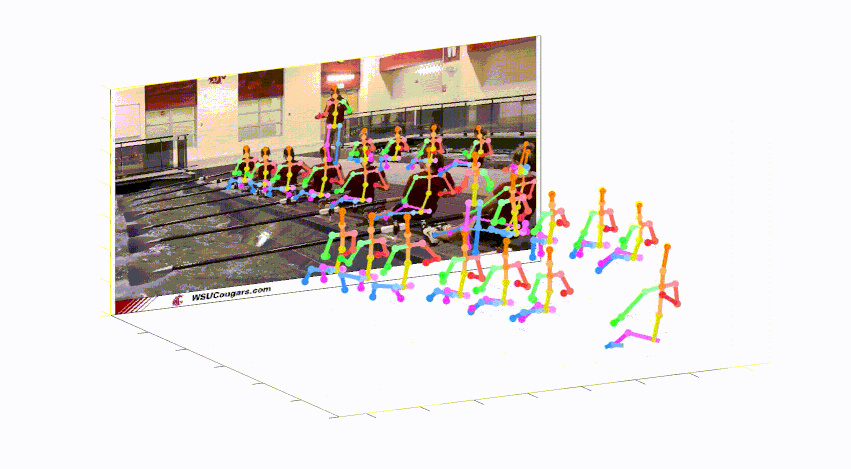
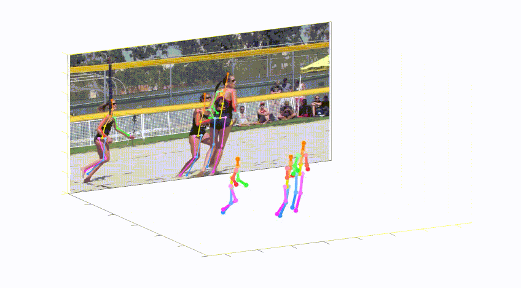
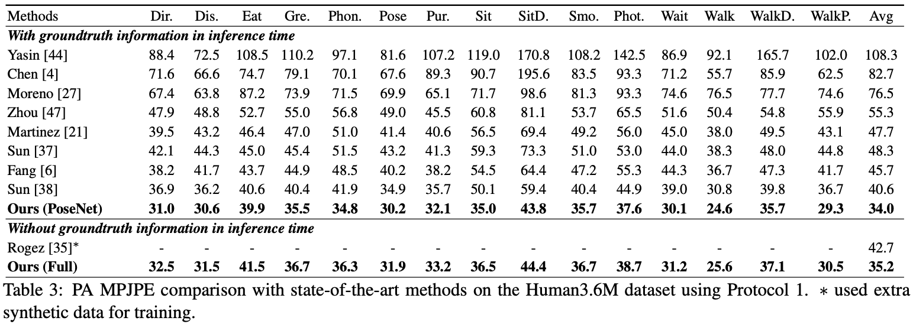
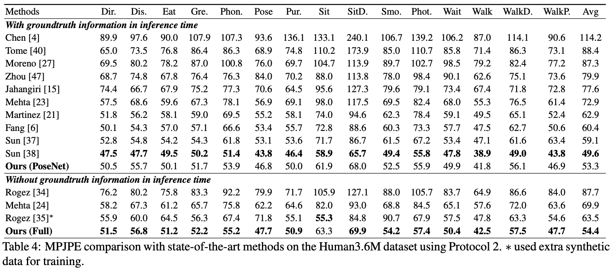
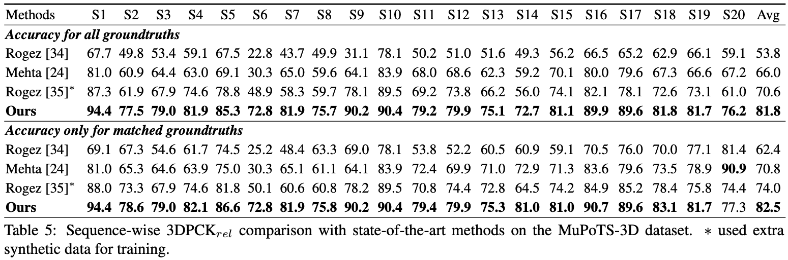

# PoseNet of "Camera Distance-aware Top-down Approach for 3D Multi-person Pose Estimation from a Single RGB Image"

<p align="center">

</p>

<p align="middle">
  
</p>


## Introduction

This repo is official **[PyTorch](https://pytorch.org)** implementation of **[Camera Distance-aware Top-down Approach for 3D Multi-person Pose Estimation from a Single RGB Image (ICCV 2019)](https://arxiv.org/abs/1907.11346)**. It contains **PoseNet** part.

**What this repo provides:**
* [PyTorch](https://pytorch.org) implementation of [Camera Distance-aware Top-down Approach for 3D Multi-person Pose Estimation from a Single RGB Image (ICCV 2019)](https://arxiv.org/abs/1907.11346).
* Flexible and simple code.
* Compatibility for most of the publicly available 2D and 3D, single and multi-person pose estimation datasets including **[Human3.6M](http://vision.imar.ro/human3.6m/description.php), [MPII](http://human-pose.mpi-inf.mpg.de/), [MS COCO 2017](http://cocodataset.org/#home), [MuCo-3DHP](http://gvv.mpi-inf.mpg.de/projects/SingleShotMultiPerson/) and [MuPoTS-3D](http://gvv.mpi-inf.mpg.de/projects/SingleShotMultiPerson/)**.
* Human pose estimation visualization code.

## Dependencies
* [PyTorch](https://pytorch.org)
* [CUDA](https://developer.nvidia.com/cuda-downloads)
* [cuDNN](https://developer.nvidia.com/cudnn)
* [Anaconda](https://www.anaconda.com/download/)
* [COCO API](https://github.com/cocodataset/cocoapi)

This code is tested under Ubuntu 16.04, CUDA 9.0, cuDNN 7.1 environment with two NVIDIA 1080Ti GPUs.

Python 3.6.5 version with Anaconda 3 is used for development.

## Quick demo
You can try quick demo at `demo` folder. 
* Download the pre-trained PoseNet in [here](https://drive.google.com/file/d/1xjefKgjsH-W8v2lVn1Hbwzp2_Su7KtG0/view?usp=sharing).
* Prepare `input.jpg` and pre-trained snapshot at `demo` folder.
* Set `bbox_list` at [here](https://github.com/mks0601/3DMPPE_POSENET_RELEASE/blob/f8d420895570682c815d37ea74e2d6b1bf646818/demo/demo.py#L68).
* Set `root_depth_list` at [here](https://github.com/mks0601/3DMPPE_POSENET_RELEASE/blob/bf4fa6f8076fcd3f636ddcc31479e2becbba19ec/demo/demo.py#L74).
* Run `python demo.py --gpu 0 --test_epoch 24` if you want to run on gpu 0.
* You can see `output_pose_2d.jpg` and new window that shows 3D pose.

## Directory

### Root
The `${POSE_ROOT}` is described as below.
```
${POSE_ROOT}
|-- data
|-- demo
|-- common
|-- main
|-- tool
|-- vis
`-- output
```
* `data` contains data loading codes and soft links to images and annotations directories.
* `demo` contains demo codes.
* `common` contains kernel codes for 3d multi-person pose estimation system.
* `main` contains high-level codes for training or testing the network.
* `tool` contains data pre-processing codes. You don't have to run this code. I provide pre-processed data below.
* `vis` contains scripts for 3d visualization.
* `output` contains log, trained models, visualized outputs, and test result.

### Data
You need to follow directory structure of the `data` as below.
```
${POSE_ROOT}
|-- data
|   |-- Human36M
|   |   |-- bbox_root
|   |   |   |-- bbox_root_human36m_output.json
|   |   |-- images
|   |   |-- annotations
|   |-- MPII
|   |   |-- images
|   |   |-- annotations
|   |-- MSCOCO
|   |   |-- bbox_root
|   |   |   |-- bbox_root_coco_output.json
|   |   |-- images
|   |   |   |-- train2017
|   |   |   |-- val2017
|   |   |-- annotations
|   |-- MuCo
|   |   |-- data
|   |   |   |-- augmented_set
|   |   |   |-- unaugmented_set
|   |   |   |-- MuCo-3DHP.json
|   |-- MuPoTS
|   |   |-- bbox_root
|   |   |   |-- bbox_mupots_output.json
|   |   |-- data
|   |   |   |-- MultiPersonTestSet
|   |   |   |-- MuPoTS-3D.json
```
* Download Human3.6M parsed data [[data](https://drive.google.com/drive/folders/1r0B9I3XxIIW_jsXjYinDpL6NFcxTZart?usp=sharing)]
* Download MPII parsed data [[images](http://human-pose.mpi-inf.mpg.de/)][[annotations](https://drive.google.com/drive/folders/1rrL_RxhwQgwhq5BU1iIRPwl285B_KTpU?usp=sharing)]
* Download MuCo parsed and composited data [[data](https://drive.google.com/drive/folders/1dfhFa1kBHYKLTKuprNc7xixt3yyKEky5?usp=sharing)]
* Download MuPoTS parsed data [[images](http://gvv.mpi-inf.mpg.de/projects/SingleShotMultiPerson/)][[annotations](https://drive.google.com/file/d/1wZ_QdqDzYqz1Lh4Yqf_-dSC568CFnfA0/view?usp=sharing)]
* All annotation files follow [MS COCO format](http://cocodataset.org/#format-data).
* If you want to add your own dataset, you have to convert it to [MS COCO format](http://cocodataset.org/#format-data).

To download multiple files from Google drive without compressing them, try [this](https://chrome.google.com/webstore/detail/drive-multiple-downloader/baolodbihgboogdhkikimhadihambecp).
If you have a problem with 'Download limit' problem when tried to download dataset from google drive link, please try this trick.  
```  
* Go the shared folder, which contains files you want to copy to your drive  
* Select all the files you want to copy  
* In the upper right corner click on three vertical dots and select “make a copy”  
* Then, the file is copied to your personal google drive account. You can download it from your personal account.  
```  

### Output
You need to follow the directory structure of the `output` folder as below.
```
${POSE_ROOT}
|-- output
|-- |-- log
|-- |-- model_dump
|-- |-- result
`-- |-- vis
```
* Creating `output` folder as soft link form is recommended instead of folder form because it would take large storage capacity.
* `log` folder contains training log file.
* `model_dump` folder contains saved checkpoints for each epoch.
* `result` folder contains final estimation files generated in the testing stage.
* `vis` folder contains visualized results.

### 3D visualization
* Run `$DB_NAME_img_name.py` to get image file names in `.txt` format.
* Place your test result files (`preds_2d_kpt_$DB_NAME.mat`, `preds_3d_kpt_$DB_NAME.mat`) in `single` or `multi` folder.
* Run `draw_3Dpose_$DB_NAME.m`

## Running 3DMPPE_POSENET
### Start
* In the `main/config.py`, you can change settings of the model including dataset to use, network backbone, and input size and so on.

### Train
In the `main` folder, run
```bash
python train.py --gpu 0-1
```
to train the network on the GPU 0,1. 

If you want to continue experiment, run 
```bash
python train.py --gpu 0-1 --continue
```
`--gpu 0,1` can be used instead of `--gpu 0-1`.

### Test
Place trained model at the `output/model_dump/`.

In the `main` folder, run 
```bash
python test.py --gpu 0-1 --test_epoch 20
```
to test the network on the GPU 0,1 with 20th epoch trained model. `--gpu 0,1` can be used instead of `--gpu 0-1`.

## Results
Here I report the performance of the PoseNet. 
* Download pre-trained models of the PoseNetNet in [here](https://drive.google.com/drive/folders/1El3qfdtgttO90X25k_680V2UCDv_TPoJ?usp=sharing) 
* Bounding boxs (from DetectNet) and root joint coordintates (from RootNet) of Human3.6M, MSCOCO, and MuPoTS-3D dataset in [here](https://drive.google.com/drive/folders/1bmQWFiT0ZU4Q7dlsRaPGqaqoCAOeThGr?usp=sharing).

#### Human3.6M dataset using protocol 1
For the evaluation, you can run `test.py` or there are evaluation codes in `Human36M`.
<p align="center">

</p>

#### Human3.6M dataset using protocol 2
For the evaluation, you can run `test.py` or there are evaluation codes in `Human36M`.
<p align="center">

</p>

#### MuPoTS-3D dataset
For the evaluation, run `test.py`.  After that, move `data/MuPoTS/mpii_mupots_multiperson_eval.m` in `data/MuPoTS/data`. Also, move the test result files (`preds_2d_kpt_mupots.mat` and `preds_3d_kpt_mupots.mat`) in `data/MuPoTS/data`. Then run `mpii_mupots_multiperson_eval.m` with your evaluation mode arguments.
<p align="center">

</p>

#### MSCOCO dataset

We additionally provide estimated 3D human root coordinates in on the MSCOCO dataset. The coordinates are in 3D camera coordinate system, and focal lengths are set to 1500mm for both x and y axis. You can change focal length and corresponding distance using equation 2 or equation in supplementarial material of my [paper](https://arxiv.org/abs/1907.11346).

## Reference
  ```
@InProceedings{Moon_2019_ICCV_3DMPPE,
  author = {Moon, Gyeongsik and Chang, Juyong and Lee, Kyoung Mu},
  title = {Camera Distance-aware Top-down Approach for 3D Multi-person Pose Estimation from a Single RGB Image},
  booktitle = {The IEEE Conference on International Conference on Computer Vision (ICCV)},
  year = {2019}
}
```


